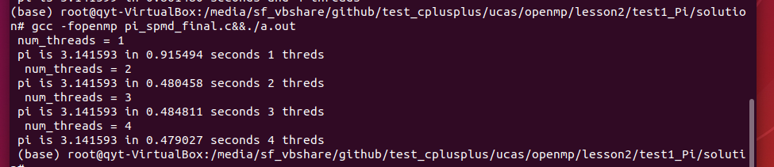

# 第一次作业

- 姓名：乔咏田
- 学号：2019Z8020661027
- 作业内容：openmp与MPI

## 运行环境

- 处理器：Intel(R) Core(TM) i7-6700HQ CPU @ 2.60GHz(2592 MHz)
- 操作系统：windows 10
- 虚拟机操作系统：Ubuntu 18.10
- 虚拟机处理器：Intel® Core™ i7-6700HQ CPU @ 2.60GHz × 2
- 虚拟机编译器：GCC

## 一、openmp

### 1、test1_Pi-pi.c

- 利用数字积分求π：`4/(1+x*x)`，初始默认程序。
- 运行命令：

~~~shell
gcc -fopenmp pi.c&&./a.out
~~~

- 运行截图：

### 2、test1_Pi-solution-pi_spmd_simple.c

- SPMD (Single Program Multiple Data)模式。
- 运行命令：

~~~shell
gcc -fopenmp pi_spmd_simple.c&&./a.out
~~~

- 运行截图：

- 运行结果，数据共享方式导致并行效率低下，并行时sum数组更新受阻：

| threads | Times(s)     |
| ------- | ------------ |
| 1       | 0.914707     |
| 2       | 0.717332     |
| 3       | 0.771921     |
| 4       | **0.818937** |

### 3、test1_Pi-solution-pi_spmd_final.c

- 修复数据共享方式，利用critical互斥消除错误共享的影响，sum修改为数字，避免array的错误共享
- 运行命令：

~~~shell
gcc -fopenmp pi_spmd_final.c&&./a.out
~~~

- 运行截图：

- 运行结果，并行运行效率明显改善。

| threads | Times(s) |
| ------- | -------- |
| 1       | 0.915494 |
| 2       | 0.480458 |
| 3       | 0.484811 |
| 4       | 0.479027 |

### 4、test1_Pi-solution-pi_loop.c

- 使用reduction对sum进行加法规约，每个线程拷贝sum，执行结束后进行合并加和。通过reduction可以**很方便**的对for循环进行并行化改造。
- 运行命令：

~~~shell
gcc -fopenmp pi_loop.c&&./a.out
~~~

- 运行截图：

- 运行结果：

| threads | Times(s) |
| ------- | -------- |
| 1       | 1.678248 |
| 2       | 0.867478 |
| 3       | 0.901523 |
| 4       | 0.861480 |

## 二、MPI

### 1、test2-mpi_helloNBsend.c

- 利用`MPI_Irecv`与`MPI_Isend`进行非阻塞通信，非阻塞通信可以立即返回，避免死锁，最后使用`MPI_Waitall`去检测通信是否结束。
- 运行命令：

~~~shell
mpicc mpi_helloNBsend.c&&mpiexec -n 2 ./a.out
~~~

- 运行截图：

### 2、test3-cpi.c

- `MPI_Bcast`广播：将数据广播移动至多个process，`MPI_Reduce`规约：执行合并操作。
- 运行命令：

~~~shell
mpicc cpi.c&&mpiexec -n 2 ./a.out
~~~

- 运行截图：

