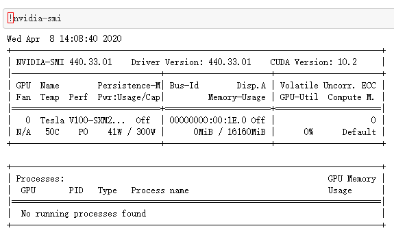
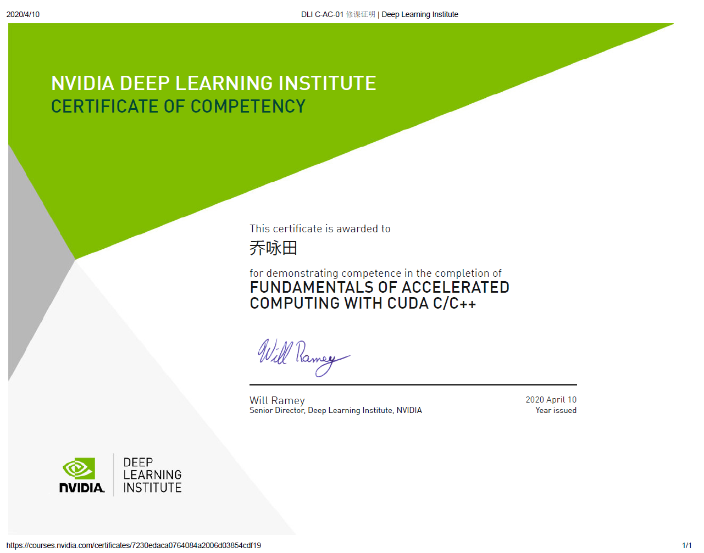

# 第一次作业

- 姓名：乔咏田
- 学号：2019Z8020661027
- 作业内容：cuda

## 运行环境

- 在**ipynb**文件中，运行 `!nvidia-smi`查看显卡信息：

## NVIDIA修课证明

## 学习要点记录

### cuda简介

- CUDA是NVIDIA公司所开发的GPU编程模型，它提供了GPU编程的简易接口，基于CUDA编程可以构建基于GPU计算的应用程序。
- CUDA是建立在NVIDIA的GPUs上的一个通用并行计算平台和编程模型，基于CUDA编程可以利用GPUs的并行计算引擎来更加高效地解决比较复杂的计算难题。

### cuda编程基础

- CUDA编程模型是一个异构模型，需要CPU和GPU协同工作。在CUDA中，host和device是两个重要的概念，我们用host指代CPU及其内存，而用device指代GPU及其内存。CUDA程序中既包含host程序，又包含device程序，它们分别在CPU和GPU上运行。同时，host与device之间可以进行通信，这样它们之间可以进行数据拷贝。
- cuda程序的执行流程通常为：
  - 分配host内存，并进行数据初始化；
  - 分配device内存，并从host将数据拷贝到device上；
  - 调用CUDA的核函数在device上完成指定的运算；
  - 将device上的运算结果拷贝到host上；
  - 释放device和host上分配的内存。

- 由于GPU实际上是异构模型，所以需要区分host和device上的代码，在CUDA中是通过函数类型限定词开区别host和device上的函数，主要的三个函数类型限定词如下：
  - `__global__`：在device上执行，从host中调用（一些特定的GPU也可以从device上调用），返回类型必须是void，不支持可变参数参数，不能成为类成员函数。注意用`__global__`定义的kernel是异步的，这意味着host不会等待kernel执行完就执行下一步。
  - `__device__`：在device上执行，单仅可以从device中调用，不可以和`__global__`同时用。
  - `__host__`：在host上执行，仅可以从host上调用，一般省略不写，不可以和`__global__`同时用，但可和`__device__`，此时函数会在device和host都编译。
- 在进行CUDA编程前，可以先检查一下自己的GPU的硬件配置，可以通过下面的程序获得GPU的配置属性：

~~~c++
int dev = 0;
cudaDeviceProp devProp;
CHECK(cudaGetDeviceProperties(&devProp, dev));
std::cout << "使用GPU device " << dev << ": " << devProp.name << std::endl;
std::cout << "SM的数量：" << devProp.multiProcessorCount << std::endl;
std::cout << "每个线程块的共享内存大小：" << devProp.sharedMemPerBlock / 1024.0 << " KB" << std::endl;
std::cout << "每个线程块的最大线程数：" << devProp.maxThreadsPerBlock << std::endl;
std::cout << "每个EM的最大线程数：" << devProp.maxThreadsPerMultiProcessor << std::endl;
std::cout << "每个EM的最大线程束数：" << devProp.maxThreadsPerMultiProcessor / 32 << std::endl;
~~~

### kernel

- kernel是在device上线程中并行执行的函数，核函数用`__global__`符号声明，在调用时需要用`<<<grid, block>>>`来指定kernel要执行的线程数量，在CUDA中，每一个线程都要执行核函数，并且每个线程会分配一个唯一的线程号thread ID，这个ID值可以通过核函数的内置变量`threadIdx`来获得。
- kernel在device上执行时实际上是启动很多线程，一个kernel所启动的所有线程称为一个网格（grid），同一个网格上的线程共享相同的全局内存空间，grid是线程结构的第一层次，而网格又可以分为很多线程块（block），一个线程块里面包含很多线程，这是第二个层次。线程两层组织结构如下图所示，这是一个gird和block均为2-dim的线程组织。grid和block都是定义为dim3类型的变量，dim3可以看成是包含三个无符号整数（x，y，z）成员的结构体变量，在定义时，缺省值初始化为1。因此grid和block可以灵活地定义为1-dim，2-dim以及3-dim结构，对于图中结构（主要水平方向为x轴），定义的grid和block如下所示，kernel在调用时也必须通过执行配置`<<<grid, block>>>`来指定kernel所使用的线程数及结构。

~~~c++
dim3 grid(3, 2);
dim3 block(5, 3);
kernel_fun<<< grid, block >>>(prams...);
~~~

- 一个线程需要两个内置的坐标变量（blockIdx，threadIdx）来唯一标识，它们都是`dim3`类型变量，其中blockIdx指明线程所在grid中的位置，而threaIdx指明线程所在block中的位置,如：

~~~c++
threadIdx.x = 1
threadIdx.y = 1
blockIdx.x = 1
blockIdx.y = 1
~~~

- 一个线程块上的线程是放在同一个流式多处理器（SM)上的，但是单个SM的资源有限，这导致线程块中的线程数是有限制的。由于SM的基本执行单元是包含32个线程的线程束，所以block大小一般要设置为32的倍数。

### cuda内存模型

- 每个线程有自己的私有本地内存（Local Memory），而每个线程块有包含共享内存（Shared Memory）,可以被线程块中所有线程共享，其生命周期与线程块一致。此外，所有的线程都可以访问全局内存（Global Memory）。还可以访问一些只读内存块：常量内存（Constant Memory）。
- 在device上分配内存，这个函数和C语言中的malloc类似，但是在device上申请一定字节大小的显存，其中devPtr是指向所分配内存的指针。要释放分配的内存使用`cudaFree`函数，这和C语言中的free函数对应。

~~~c++
cudaError_t cudaMalloc(void** devPtr, size_t size);
~~~

- host和device之间数据通信，其中src指向数据源，而dst是目标区域，count是复制的字节数，其中kind控制复制的方向：cudaMemcpyHostToHost, cudaMemcpyHostToDevice, cudaMemcpyDeviceToHost及cudaMemcpyDeviceToDevice，如cudaMemcpyHostToDevice将host上数据拷贝到device上。

~~~c++
cudaError_t cudaMemcpy(void* dst, const void* src, size_t count, cudaMemcpyKind kind)
~~~

- 单独在host和device上进行内存分配，并且要进行数据拷贝，这是很容易出错的。在CUDA 6.0引入统一内存（Unified Memory）来避免这种麻烦，简单来说就是统一内存使用一个托管内存来共同管理host和device中的内存，并且自动在host和device中进行数据传输。CUDA中使用`cudaMallocManaged`函数分配托管内存，由于托管内存自动进行数据传输，要用`cudaDeviceSynchronize()`函数保证device和host同步，这样后面才可以正确访问kernel计算的结果：

~~~c++
cudaError_t cudaMallocManaged(void **devPtr, size_t size, unsigned int flag=0);
~~~

### 在device上完成指定的运算

- 向量加法，kernel定义，grid和block都设计为1-dim，其中stride是整个grid的线程数，有时候向量的元素数很多，这时候可以将在每个线程实现多个元素（元素总数/线程总数）的加法，相当于使用了多个grid来处理：

~~~c++
// 两个向量加法kernel，grid和block均为一维
__global__ void add(float* x, float * y, float* z, int n)
{
    // 获取全局索引
    int index = threadIdx.x + blockIdx.x * blockDim.x;
    // 步长
    int stride = blockDim.x * gridDim.x;
    for (int i = index; i < n; i += stride)
    {
        z[i] = x[i] + y[i];
    }
}
~~~

- 具体实现向量加法：

~~~c++
int main()
{
    int N = 1 << 20;
    int nBytes = N * sizeof(float);

    // 申请托管内存
    float *x, *y, *z;
    cudaMallocManaged((void**)&x, nBytes);
    cudaMallocManaged((void**)&y, nBytes);
    cudaMallocManaged((void**)&z, nBytes);

    // 初始化数据
    for (int i = 0; i < N; ++i)
    {
        x[i] = 10.0;
        y[i] = 20.0;
    }

    // 定义kernel的执行配置
    dim3 blockSize(256);
    dim3 gridSize((N + blockSize.x - 1) / blockSize.x);
    // 执行kernel
    add << < gridSize, blockSize >> >(x, y, z, N);

    // 同步device 保证结果能正确访问
    cudaDeviceSynchronize();
    // 检查执行结果
    float maxError = 0.0;
    for (int i = 0; i < N; i++)
        maxError = fmax(maxError, fabs(z[i] - 30.0));
    std::cout << "最大误差: " << maxError << std::endl;

    // 释放内存
    cudaFree(x);
    cudaFree(y);
    cudaFree(z);

    return 0;
}
~~~

- 矩阵乘法kernel定义：

~~~c++
// 获取矩阵A的(row, col)元素
__device__ float getElement(Matrix *A, int row, int col)
{
    return A->elements[row * A->width + col];
}

// 为矩阵A的(row, col)元素赋值
__device__ void setElement(Matrix *A, int row, int col, float value)
{
    A->elements[row * A->width + col] = value;
}

// 矩阵相乘kernel，2-D，每个线程计算一个元素
__global__ void matMulKernel(Matrix *A, Matrix *B, Matrix *C)
{
    float Cvalue = 0.0;
    int row = threadIdx.y + blockIdx.y * blockDim.y;
    int col = threadIdx.x + blockIdx.x * blockDim.x;
    for (int i = 0; i < A->width; ++i)
    {
        Cvalue += getElement(A, row, i) * getElement(B, i, col);
    }
    setElement(C, row, col, Cvalue);
}
~~~

- 采用统一内存编写矩阵相乘:

~~~c++
int main()
{
    int width = 1 << 10;
    int height = 1 << 10;
    Matrix *A, *B, *C;
    // 申请托管内存
    cudaMallocManaged((void**)&A, sizeof(Matrix));
    cudaMallocManaged((void**)&B, sizeof(Matrix));
    cudaMallocManaged((void**)&C, sizeof(Matrix));
    int nBytes = width * height * sizeof(float);
    cudaMallocManaged((void**)&A->elements, nBytes);
    cudaMallocManaged((void**)&B->elements, nBytes);
    cudaMallocManaged((void**)&C->elements, nBytes);

    // 初始化数据
    A->height = height;
    A->width = width;
    B->height = height;
    B->width = width;
    C->height = height;
    C->width = width;
    for (int i = 0; i < width * height; ++i)
    {
        A->elements[i] = 1.0;
        B->elements[i] = 2.0;
    }

    // 定义kernel的执行配置
    dim3 blockSize(32, 32);
    dim3 gridSize((width + blockSize.x - 1) / blockSize.x, 
        (height + blockSize.y - 1) / blockSize.y);
    // 执行kernel
    matMulKernel << < gridSize, blockSize >> >(A, B, C);

    // 同步device 保证结果能正确访问
    cudaDeviceSynchronize();
    // 检查执行结果
    float maxError = 0.0;
    for (int i = 0; i < width * height; ++i)
        maxError = fmax(maxError, fabs(C->elements[i] - 2 * width));
    std::cout << "最大误差: " << maxError << std::endl;

    return 0;
}
~~~

