# 第一次作业

- 姓名：乔咏田
- 学号：2019Z8020661027

## 运行环境

- 处理器：Intel(R) Core(TM) i7-6700HQ CPU @ 2.60GHz(2592 MHz)
- 操作系统：windows 10
- 虚拟机操作系统：Ubuntu 18.10
- 虚拟机处理器：Intel® Core™ i7-6700HQ CPU @ 2.60GHz × 2
- 虚拟机编译器：GCC

## helloworld

### hello.c

- 运行命令：

~~~shell
gcc hello.c&&./a.out
~~~

- 运行截图：

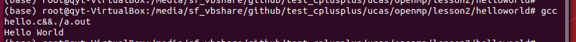

### hello_par.c

- 运行命令：

~~~shell
gcc -fopenmp hello_par.c&&./a.out
~~~

- 运行截图：

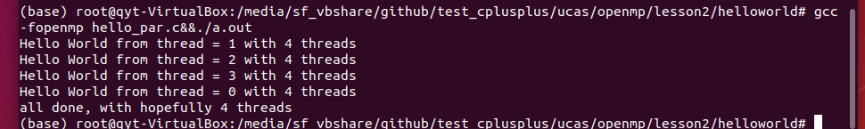

## test1_Pi

### pi.c

- 运行命令：

~~~shell
gcc -fopenmp pi.c&&./a.out
~~~

- 运行截图：

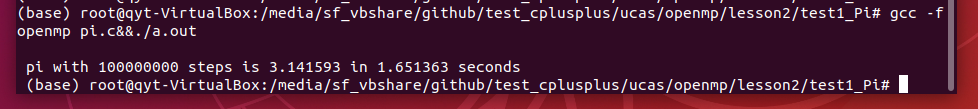

### solution-pi_loop.c

- 运行命令：

~~~shell
gcc -fopenmp pi_loop.c&&./a.out
~~~

- 运行截图：

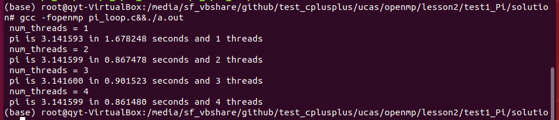

### solution-pi_spmd_final.c

- 运行命令：

~~~shell
gcc -fopenmp pi_spmd_final.c&&./a.out
~~~

- 运行截图：

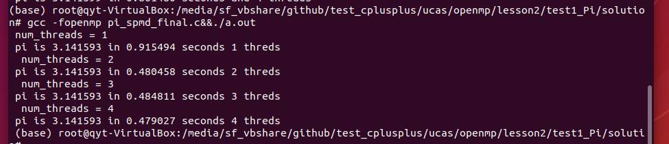

### solution-pi_spmd_simple.c

- 运行命令：

~~~shell
gcc -fopenmp pi_spmd_simple.c&&./a.out
~~~

- 运行截图：

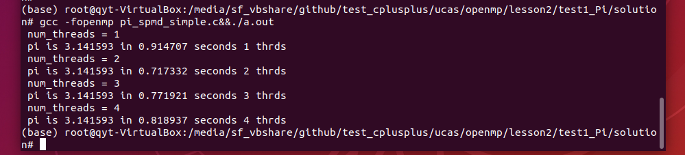

## test2_Fibonacci

### linked.c

- 运行命令：

~~~shell
gcc -fopenmp linked.c&&./a.out
~~~

- 运行截图：

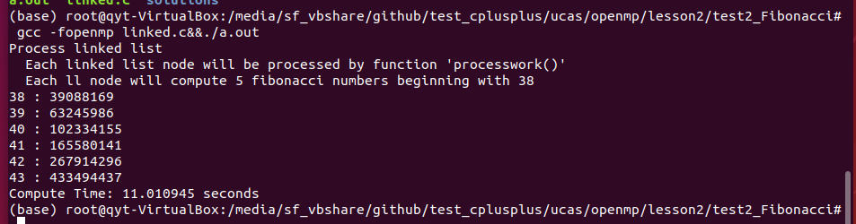

### solutions-linked_omp3_tasks.c

- 运行命令：

~~~shell
gcc -fopenmp linked_omp3_tasks.c&&./a.out
~~~

- 运行截图：

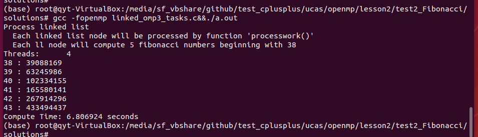

### solutions-linked_omp25.c

- 运行命令：

~~~shell
gcc -fopenmp linked_omp25.c&&./a.out
~~~

- 运行截图：

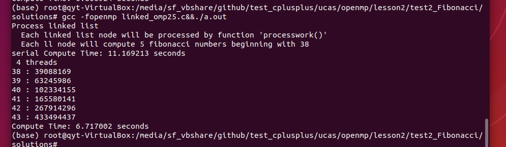

## test3_Pi_mc

### pi_mc.c

- 运行命令：

~~~shell
gcc -fopenmp pi_mc.c&&./a.out
~~~

- 运行截图：

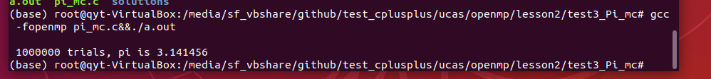

### solutions-pi_mc_par.c-random_par.c

- 运行命令：

~~~shell
gcc -fopenmp pi_mc_par.c random_par.c&&./a.out
~~~

- 运行截图：

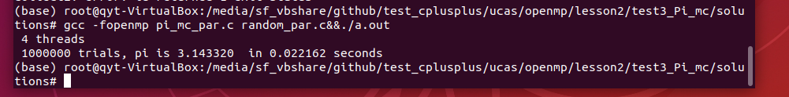

### solutions-pi_mc_par.c-random_seq_lcg.c

- 运行命令：

~~~shell
gcc -fopenmp pi_mc_par.c random_seq_lcg.c&&./a.out
~~~

- 运行截图：

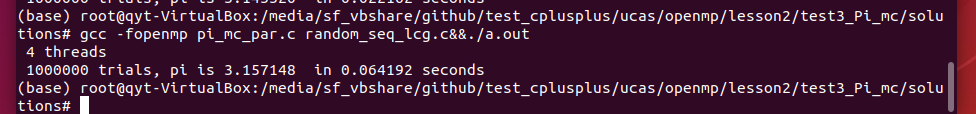