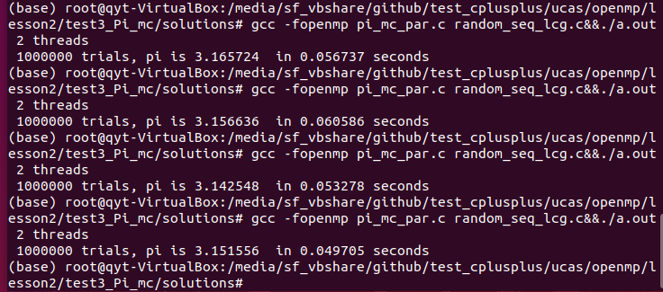
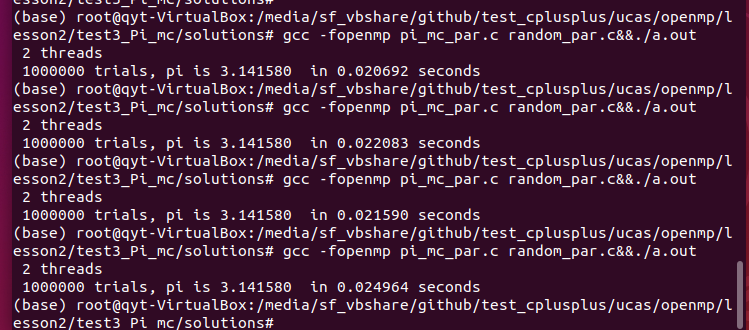

# 第一次作业

- 姓名：乔咏田
- 学号：2019Z8020661027

## 运行环境

- 处理器：Intel(R) Core(TM) i7-6700HQ CPU @ 2.60GHz(2592 MHz)
- 操作系统：windows 10
- 虚拟机操作系统：Ubuntu 18.10
- 虚拟机处理器：Intel® Core™ i7-6700HQ CPU @ 2.60GHz × 2
- 虚拟机编译器：GCC

## helloworld

### hello.c

- 串行运行。
- 运行命令：

~~~shell
gcc hello.c&&./a.out
~~~

- 运行截图：

### hello_par.c

- 4个thread并行运行。
- 运行命令：

~~~shell
gcc -fopenmp hello_par.c&&./a.out
~~~

- 运行截图：

## test1_Pi

### pi.c

- 利用数字积分求π：`4/(1+x*x)`，初始默认程序。
- 运行命令：

~~~shell
gcc -fopenmp pi.c&&./a.out
~~~

- 运行截图：

### solution-pi_spmd_simple.c

- SPMD (Single Program Multiple Data)模式。
- 运行命令：

~~~shell
gcc -fopenmp pi_spmd_simple.c&&./a.out
~~~

- 运行截图：

- 运行结果，数据共享方式导致并行效率低下，并行时sum数组更新受阻：

| threads | Times(s)     |
| ------- | ------------ |
| 1       | 0.914707     |
| 2       | 0.717332     |
| 3       | 0.771921     |
| 4       | **0.818937** |

### solution-pi_spmd_final.c

- 修复数据共享方式，利用critical互斥消除错误共享的影响，sum修改为数字，避免array的错误共享
- 运行命令：

~~~shell
gcc -fopenmp pi_spmd_final.c&&./a.out
~~~

- 运行截图：

- 运行结果，并行运行效率明显改善。

| threads | Times(s) |
| ------- | -------- |
| 1       | 0.915494 |
| 2       | 0.480458 |
| 3       | 0.484811 |
| 4       | 0.479027 |

### solution-pi_loop.c

- 使用reduction对sum进行加法规约，每个线程拷贝sum，执行结束后进行合并加和。通过reduction可以**很方便**的对for循环进行并行化改造。
- 运行命令：

~~~shell
gcc -fopenmp pi_loop.c&&./a.out
~~~

- 运行截图：

- 运行结果：

| threads | Times(s) |
| ------- | -------- |
| 1       | 1.678248 |
| 2       | 0.867478 |
| 3       | 0.901523 |
| 4       | 0.861480 |

## test2_Fibonacci

### linked.c

- 串行
- 运行命令：

~~~shell
gcc -fopenmp linked.c&&./a.out
~~~

- 运行截图，运行时间11.010945s：

### solutions-linked_omp25.c

- 使用`schedule(static,1)`静态调度非常简单的将for循环分配到多个线程。
- 运行命令：

~~~shell
gcc -fopenmp linked_omp25.c&&./a.out
~~~

- 运行截图，运行时间缩短至6.717002s：

### solutions-linked_omp3_tasks.c

- 用task定义任务，解决while循环并行化问题
- 运行命令：

~~~shell
gcc -fopenmp linked_omp3_tasks.c&&./a.out
~~~

- 运行截图，运行时间6.806924s：

## test3_Pi_mc

### pi_mc.c

- 蒙特卡洛方法计算π，串行
- 运行命令：

~~~shell
gcc -fopenmp pi_mc.c&&./a.out
~~~

- 运行截图：

### solutions-pi_mc_par.c-random_seq_lcg.c

- 并行
- 运行命令：

~~~shell
gcc -fopenmp pi_mc_par.c random_seq_lcg.c&&./a.out
~~~

- 运行截图：

- 运行多次，每次得到的值不同，LCG generator线程不安全：

### solutions-pi_mc_par.c-random_par.c

- 使用threadprivate，做到线程安全，是random_last在每个线程中有自己的副本。
- 运行命令：

~~~shell
gcc -fopenmp pi_mc_par.c random_par.c&&./a.out
~~~

- 运行截图：

- 多次运行截图，可以看到每次结果都是一样的：

